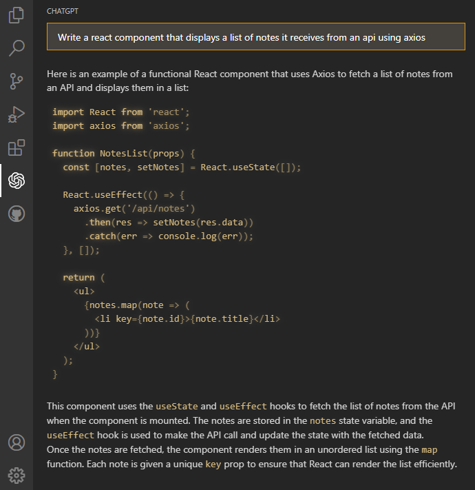
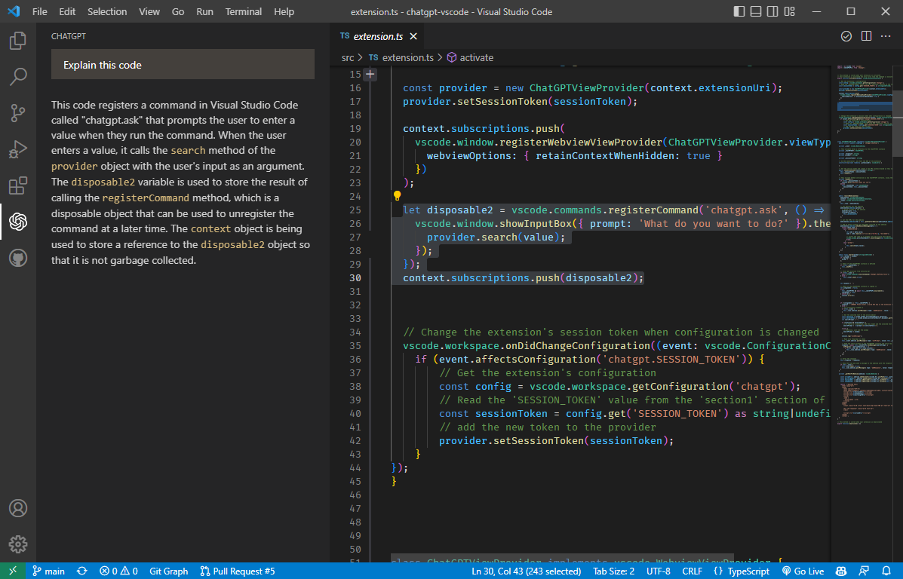
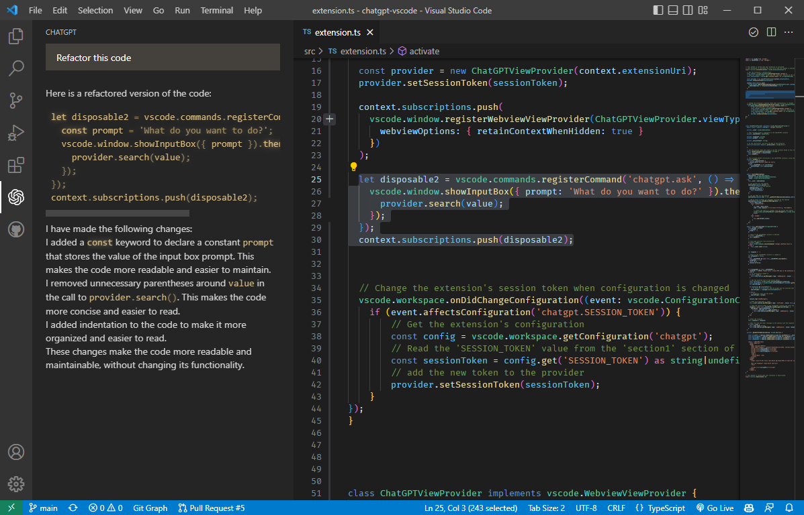

# ChatGPT Extension for VSCode

This Visual Studio Code extension allows you to use the [unofficial ChatGPT API](https://github.com/transitive-bullshit/chatgpt-api) to generate natural language responses from OpenAI's [ChatGPT](https://chat.openai.com/chat) to your questions, right within the editor.

## Sponsors

[What The Diff](https://whatthediff.ai/?ref=gh-chatgpt) - your AI powered code review assistant

### [Marketplace](https://marketplace.visualstudio.com/items?itemName=timkmecl.chatgpt)

 

## Features
- **Ask general questions** or use code snippets from the editor to query ChatGPT via an input box in the sidebar
- Right click on a code selection and run one of the context menu **shortcuts**
- View ChatGPT's responses in a panel next to the editor
- Ask **follow-up questions** to the response (conversation context is maintained)
- **Insert code snippets** from the AI's response into the active editor by clicking on them

## Installation

To use this extension, install it from the VSCode marketplace or download and install `.vsix` file from Releases.

1. After the installation is complete, you will need to add your ChatGPT session token to the extension settings in VSCode. To do this, open the `Settings` panel by going to the `Code` menu and selecting `Preferences`, then `Settings`.
2. In the search bar, type `ChatGPT` to filter the settings list.
3. In the ChatGPT section, enter your session token in the `SESSION_TOKEN` field.

After completing these steps, the extension should be ready to use. 

### Obtaining the session token

To use this extension, you will need to authenticate with a valid session token from ChatGPT. To get a session token:

1. Go to https://chat.openai.com/chat and log in or sign up.
2. Open the developer tools in your browser.
3. Go to the `Application` tab and open the `Cookies` section.
4. Copy the value for `__Secure-next-auth.session-token` and save it.

Once you have obtained a session token, you can configure the extension to use it as described in the previous section.

## Using the Extension

To use the extension, open a text editor in Visual Studio Code and open the ChatGPT panel by clicking on the ChatGPT icon in the sidebar. This will open a panel with an input field where you can enter your prompt or question. By clicking enter, it will be sent to ChatGPT. Its response will be displayed below the input field in the sidebar (note that it may take some time for it to be calculated).

You can also select a code snippet in the editor and then enter a prompt in the side panel, or right-click and select "Ask ChatGPT". The selected code will be automatically appended to your query when it is sent to the AI. This can be useful for generating code snippets or getting explanations for specific pieces of code.

To insert a code snippet from the AI's response into the editor, simply click on the code block in the panel. The code will be automatically inserted at the cursor position in the active editor.

You can select some code in the editor, right click on it and choose one of the following from the context menu:
#### Commands:
- `Ask ChatGPT`: will provide a prompt for you to enter any query
- `ChatGPT: Explain selection`: will explain what the selected code does
- `ChatGPT: Refactor selection`: will try to refactor the selected code
- `ChatGPT: Find problems`: looks for problems/errors in the selected code, fixes and explains them
- `ChatGPT: Optimize selection`: tries to optimize the selected code

`Ask ChatGPT` is also available when nothing is selected. For the other four commands, you can customize the exact prompt that will be sent to the AI by editing the extension settings in VSCode Preferences.

Because ChatGPT is a conversational AI, you can ask follow-up questions to the response. The conversation context is maintained between queries, so you can ask multiple questions in a row. 
To **reset the conversation context**, click `ctrl+shift+p` and select `ChatGPT: Reset Conversation`.

---

Please note that this extension is currently a proof of concept and may have some limitations or bugs. We welcome feedback and contributions to improve the extension.

## Credits

- This wouldn't be possible without OpenAI's [ChatGPT](https://chat.openai.com/chat)
- The extension makes use of [chatgpt-api](https://github.com/transitive-bullshit/chatgpt-api) (by [Travis Fischer](https://github.com/transitive-bullshit)), which uses ChatGPT unofficial API in order to login and communicate with it.
- It is built on top of [mpociot/chatgpt-vscode](https://github.com/mpociot/chatgpt-vscode), which started this project
- `v0.3` inspired and based on [barnesoir/chatgpt-vscode-plugin](https://github.com/barnesoir/chatgpt-vscode-plugin) and [gencay/vscode-chatgpt](https://github.com/gencay/vscode-chatgpt)
